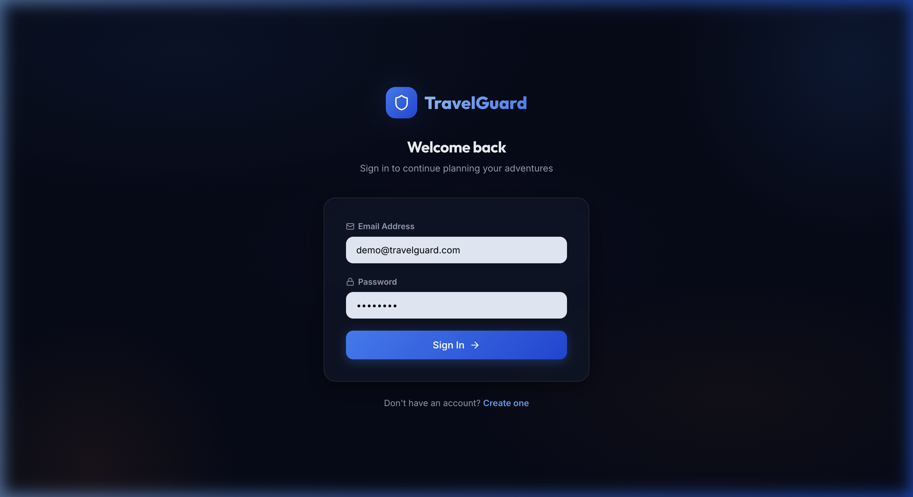
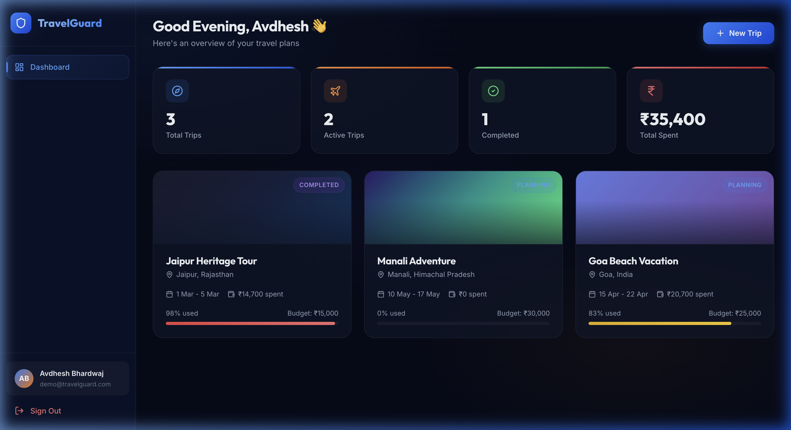
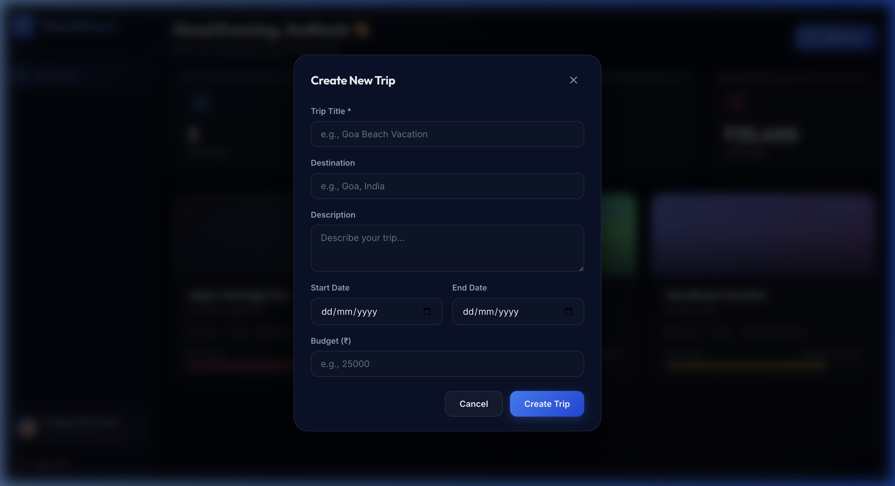
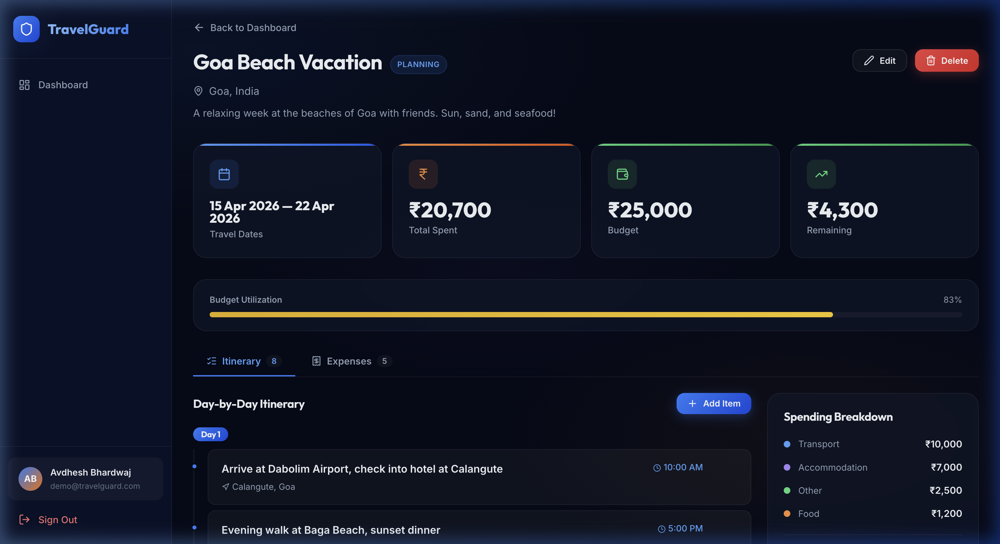
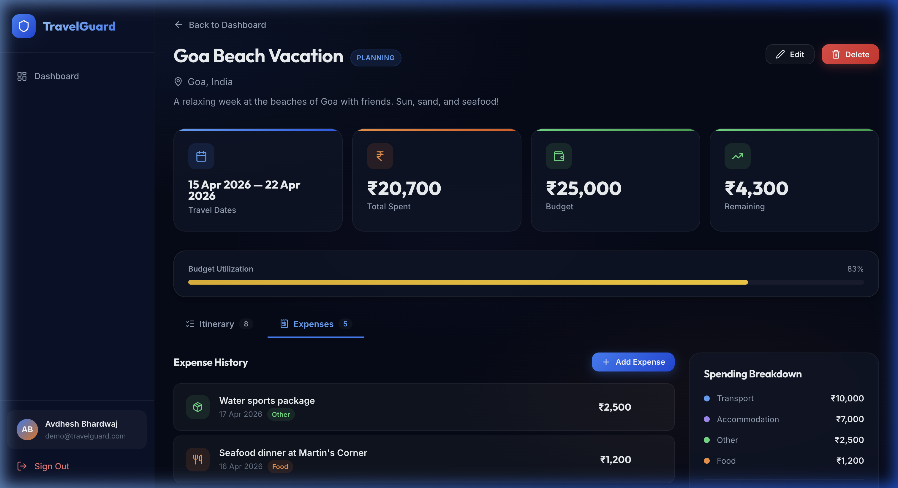
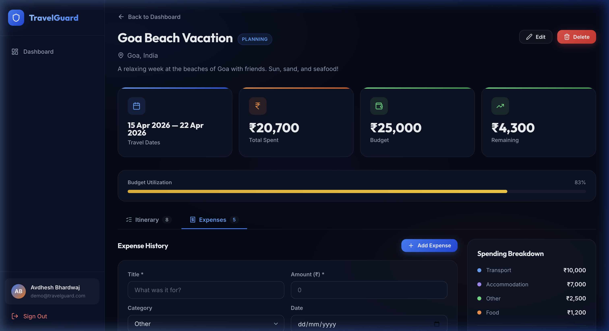

# TravelGuard — User Guide

> Your complete guide to planning trips, tracking expenses, and managing itineraries with TravelGuard.

---

## What is TravelGuard?

TravelGuard is an **intelligent travel planning platform** that helps you organize every aspect of your trips in one place. Whether you're planning a beach getaway to Goa, a mountain trek in Manali, or a heritage tour of Jaipur — TravelGuard keeps your plans, budgets, and daily activities organized and accessible.

### Who is this for?

- 🎒 **Solo travelers** who want to plan and budget trips independently
- 👨‍👩‍👧‍👦 **Families** planning vacations and tracking group expenses
- 🎓 **Students** organizing college trips on a tight budget
- 💼 **Business travelers** tracking work-related travel expenses

### What can you do with TravelGuard?

| Feature | Description |
|---------|-------------|
| **Trip Management** | Create, organize, and track multiple trips |
| **Itinerary Planning** | Build day-by-day activity plans with times and locations |
| **Expense Tracking** | Log every expense by category (food, transport, stay, etc.) |
| **Budget Monitoring** | Set a budget and see real-time utilization with visual progress bars |
| **Dashboard Overview** | Get a bird's-eye view of all your trips, spending, and stats |

---

## Getting Started

### Step 1 — Create Your Account

Open the app at **http://localhost:5173** and you'll land on the login page.

If you're a first-time user, click **"Create one"** at the bottom to go to the registration page.

Fill in:
- **Full Name** — Your display name (e.g., "Avdhesh Bhardwaj")
- **Email Address** — A unique email to identify your account
- **Password** — At least 6 characters

Click **"Create Account"** and you'll be automatically logged in and redirected to the Dashboard.

> [!TIP]
> A demo account is pre-loaded with sample data for exploration:
> - **Email:** `demo@travelguard.com`
> - **Password:** `demo1234`

---

### Step 2 — Explore the Dashboard

Once logged in, the **Dashboard** is your home base. It gives you a complete overview of your travel life.

Here's what you'll see:

#### Stats Cards (Top Row)
Four summary cards at the top give you an instant snapshot:

| Card | What it shows |
|------|--------------|
| **Total Trips** | How many trips you've created |
| **Active Trips** | Trips currently in "planning" or "active" status |
| **Completed** | How many trips you've finished |
| **Total Spent** | Combined spending across all your trips (in ₹) |

#### Trip Cards (Below Stats)
Each trip appears as a card showing:
- **Trip name** and **destination**
- **Travel dates**
- **Amount spent** so far
- A **budget progress bar** showing how much of the budget is used
- A **status badge** (Planning, Active, or Completed)

#### Sidebar (Left)
- **TravelGuard logo** — click to return to dashboard
- **Dashboard** link — your home page
- **Your profile** — shows your name and email at the bottom
- **Sign Out** — logs you out of the app

---

### Step 3 — Create a New Trip

Click the **"+ New Trip"** button in the top-right corner of the dashboard.

A modal window opens with the following fields:

| Field | Required? | Example |
|-------|-----------|---------|
| **Trip Title** | ✅ Yes | "Goa Beach Vacation" |
| **Destination** | Optional | "Goa, India" |
| **Description** | Optional | "A relaxing week at the beaches of Goa" |
| **Start Date** | Optional | 2026-04-15 |
| **End Date** | Optional | 2026-04-22 |
| **Budget (₹)** | Optional | 25000 |

Click **"Create Trip"** and your trip is saved. It will appear instantly on the dashboard.

> [!NOTE]
> Setting a budget is highly recommended — it enables the budget utilization progress bar, so you can easily track if you're overspending.

---

### Step 4 — Plan Your Itinerary

Click on any trip card on the Dashboard to open the **Trip Details** page.

The Trip Details page shows:

1. **Trip Header** — Title, status badge, destination, and description
2. **Edit / Delete buttons** — Modify or remove the trip
3. **Stats Cards** — Travel dates, total spent, budget, and remaining balance
4. **Budget Utilization Bar** — Visual progress of how much you've spent vs. your budget
5. **Itinerary Tab** (selected by default) — Day-by-day activity plan

#### Adding an Itinerary Item

Click **"+ Add Item"** next to the "Day-by-Day Itinerary" heading. Fill in:

| Field | Required? | Example |
|-------|-----------|---------|
| **Day Number** | ✅ Yes | 1 |
| **Activity** | ✅ Yes | "Visit Amber Fort and take a guided tour" |
| **Location** | Optional | "Amber, Jaipur" |
| **Time** | Optional | "9:00 AM" |

Click **"Add Item"** and it appears in the timeline, grouped by day number.

> [!TIP]
> Itinerary items are automatically grouped and sorted by day. Add multiple activities for the same day and they'll appear together under a "Day X" header.

#### Deleting an Itinerary Item

Hover over any itinerary item and a **🗑 delete icon** appears on the right. Click it to remove the item.

---

### Step 5 — Track Your Expenses

Switch to the **Expenses** tab to view and manage your spending.

Each expense shows:
- A **category icon** (colored by type)
- **Expense title** (what you spent on)
- **Date** and **category badge**
- **Amount** in ₹

The **Spending Breakdown** panel on the right shows your expenses grouped by category with totals.

#### Adding an Expense

Click **"+ Add Expense"** to open the inline form.

Fill in:

| Field | Required? | Example |
|-------|-----------|---------|
| **Title** | ✅ Yes | "Hotel booking — 3 nights" |
| **Amount (₹)** | ✅ Yes | 4500 |
| **Category** | Optional (defaults to "Other") | Food & Dining, Transport, Accommodation, Other |
| **Date** | Optional (defaults to today) | 2026-04-16 |

Click **"Add Expense"** and it's saved immediately. The budget bar, stats, and spending breakdown all update in real-time.

#### Expense Categories

| Category | What to track | Icon Color |
|----------|--------------|------------|
| 🍽 **Food & Dining** | Restaurants, street food, snacks, drinks | Orange |
| 🚗 **Transport** | Flights, trains, taxis, fuel, rentals | Blue |
| 🏨 **Accommodation** | Hotels, hostels, Airbnb, resorts | Purple |
| 📦 **Other** | Tickets, shopping, souvenirs, miscellaneous | Green |

---

### Step 6 — Edit or Delete a Trip

On the Trip Details page, use the buttons in the top-right corner:

- **✏️ Edit** — Opens a modal to update the trip title, destination, dates, budget, or status
- **🗑 Delete** — Opens a confirmation dialog before permanently deleting the trip and all its data

> [!CAUTION]
> Deleting a trip is permanent and removes all associated itinerary items and expenses. This action cannot be undone.

#### Changing Trip Status

When editing a trip, you can change its status:

| Status | Meaning |
|--------|---------|
| **Planning** | You're still preparing for this trip |
| **Active** | The trip is currently happening |
| **Completed** | The trip is finished |

---

## Common Use Cases

### 🏖 Use Case 1 — Planning a Vacation

> *"I want to plan a 5-day trip to Goa with my friends and keep track of our ₹25,000 budget."*

1. **Create the trip** — Set title, destination "Goa, India", dates, and budget ₹25,000
2. **Build the itinerary** — Add day-by-day activities:
   - Day 1: Arrive, check into hotel, explore Baga Beach
   - Day 2: Dudhsagar Waterfalls excursion
   - Day 3: Water sports at Calangute
   - Day 4: South Goa exploration
   - Day 5: Shopping at flea market, departure
3. **Track expenses** as you spend — flights ₹8,500, hotel ₹7,000, food ₹3,000, etc.
4. **Monitor the budget bar** — At 83% utilization, you know you're close to the limit
5. **Mark as completed** when you return home

---

### 💼 Use Case 2 — Business Travel Expense Report

> *"I need to track all expenses from my Delhi business trip for reimbursement."*

1. **Create the trip** — "Delhi Client Meeting", set dates and a reference budget
2. **Log every expense** under the right category:
   - Transport: Flight ₹5,200, Uber ₹800
   - Accommodation: Hotel ₹4,000
   - Food: Client dinner ₹2,500, working lunch ₹600
3. **Review the Spending Breakdown** panel — See totals per category
4. **Use the expense list as a report** — All amounts, dates, and categories are organized

---

### 🎓 Use Case 3 — Student Group Trip on a Budget

> *"Our college group has ₹5,000 per person for a Manali trip. We need to stay on track."*

1. **Create the trip** with a total group budget
2. **Plan the itinerary** — Assign activities to each day so everyone's on the same page
3. **Add expenses** as the group spends — split equally and log the total
4. **Watch the budget bar** — If it turns yellow (70%+) or red (90%+), time to cut back!
5. **After the trip**, review the full expense history to settle up

---

### 🕌 Use Case 4 — Heritage Tour with Multiple Stops

> *"I'm visiting Jaipur for 4 days and want to plan out every fort and palace visit."*

1. **Create the trip** — "Jaipur Heritage Tour" with budget ₹15,000
2. **Build a detailed itinerary**:
   - Day 1: Amber Fort (9 AM), Jaigarh Fort (2 PM)
   - Day 2: Hawa Mahal (9 AM), City Palace (11 AM), Jantar Mantar (2 PM)
   - Day 3: Nahargarh Fort sunset (4 PM), Chokhi Dhani (7 PM)
   - Day 4: Shopping at Johari Bazaar, departure
3. **Track entry fees, food, and transport** — see the category breakdown at the end

---

## Tips & Best Practices

> [!TIP]
> **Always set a budget** — Even a rough estimate helps you track spending and avoid surprises.

> [!TIP]
> **Log expenses immediately** — Add expenses as they happen so you don't forget small purchases.

> [!TIP]
> **Use categories wisely** — Categorizing expenses helps you see where your money goes (most travelers overspend on food!).

> [!TIP]
> **Plan itinerary by day** — Use day numbers to organize your activities chronologically. Include times for a structured plan.

---

## Quick Reference

| Action | How To |
|--------|--------|
| Create account | Visit `/register`, fill the form, click "Create Account" |
| Login | Visit `/login`, enter email & password, click "Sign In" |
| Create trip | Dashboard → "+ New Trip" button |
| View trip details | Dashboard → Click on a trip card |
| Add itinerary item | Trip Details → Itinerary tab → "+ Add Item" |
| Add expense | Trip Details → Expenses tab → "+ Add Expense" |
| Edit trip | Trip Details → "Edit" button |
| Delete trip | Trip Details → "Delete" button → Confirm |
| Sign out | Sidebar → "Sign Out" at the bottom |

---

## Keyboard & Navigation

- All pages are navigable via clicks — no keyboard shortcuts are required
- Use the **"← Back to Dashboard"** link on the Trip Details page to return
- The **sidebar** is always visible on desktop for quick navigation
- On **mobile**, tap the **☰ menu button** to open/close the sidebar

---

*TravelGuard — Plan Smart, Travel Safe* 🛡️
